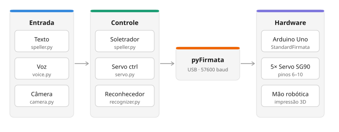

<div align="center">

[](https://www.python.org/)
[](https://www.arduino.cc/)
[](https://mediapipe.dev/)
[](https://streamlit.io/)
[](https://www.gnu.org/licenses/gpl-3.0)


---

<h4>RoboLibras: Objeto de Aprendizagem Multimodal para o Ensino do Alfabeto Manual da LIBRAS</h4>

<a href="#resumo">Resumo</a> •
<a href="#arquitetura-do-sistema">Arquitetura</a> •
<a href="#hardware">Hardware</a> •
<a href="#instalação">Instalação</a> •
<a href="#uso">Uso</a> •
<a href="#estrutura-do-repositório">Estrutura</a> •
<a href="#limitações-conhecidas">Limitações</a> •
<a href="#referências">Referências</a>

</div>

---

## Resumo

O ensino de Língua Brasileira de Sinais (LIBRAS) em contextos inclusivos enfrenta a escassez de recursos didáticos interativos. Este trabalho apresenta o RoboLibras, um objeto de aprendizagem para o ensino do alfabeto manual da LIBRAS que integra três modalidades de interação — texto, voz e gestos via câmera — com o controle de uma mão robótica. O sistema utiliza visão computacional e aprendizado de máquina para reconhecer a pose da mão do usuário em tempo real, oferecendo feedback imediato sobre o sinal realizado. A interface web disponibiliza cinco modos de aprendizagem — Modo Aula, Quiz, Soletração, Espelhamento e Siga o Sinal — permitindo uso tanto pelo professor quanto pelo estudante, com ou sem Arduino conectado.

---

## Arquitetura do Sistema

### Visão Geral



### Modalidades de entrada

| Modalidade | Descrição | Implementação |
|---|---|---|
| **Texto** | Soletração sequencial a partir de string digitada pelo usuário | `src/speller.py` |
| **Voz** | Reconhecimento de fala contínuo em pt-BR em thread assíncrona | `src/voice.py` + Google Speech API |
| **Câmera** | Reconhecimento e espelhamento em tempo real via estimativa de pose da mão | `src/camera.py` + MediaPipe |

### Codificação das poses

Cada caractere é representado como um vetor de 5 valores discretos (um por dedo), mapeados a ângulos de servo na tabela `SERVO_ANGLES` em `src/config.py`:

| Valor | Estado | Descrição |
|---|---|---|
| `0` | ○ Aberto | Dedo totalmente estendido |
| `0.33` | ◔ Pouco | Leve curvatura (~33% do range) |
| `0.66` | ◑ Meio | Semiflexão (~66% do range) |
| `1` | ● Fechado | Flexão máxima |

**Exemplo — letra L:**

```python
{"polegar": 0, "indicador": 0, "medio": 1, "anelar": 1, "minimo": 1}
#  ○ aberto      ○ aberto      ● fechado   ● fechado   ● fechado
```

O dicionário completo de poses (`src/poses.py`) cobre as **26 letras** do alfabeto manual da LIBRAS (A–Z), além dos dígitos 0–5 como suporte extra.

---

## Hardware

### Lista de materiais

| Componente | Qtd | Especificação |
|---|---|---|
| Arduino Uno / Nano | 1 | Qualquer placa compatível com StandardFirmata |
| Micro servo SG90 | 5 | Torque: 1,8 kgf·cm; range: 0–180°; alimentação: 4,8–6 V |
| Mão robótica | 1 | Impressão 3D com acionamento por tendões |
| Fios jumper M-M | ~16 | Conexão servos → pinos digitais do Arduino |

> ⚠️ **Alimentação:** recomenda-se fonte externa regulada de 5 V para os servos. Alimentar 5 servos SG90 simultaneamente pelo pino 5 V do Arduino pode exceder a corrente máxima suportada (~500 mA via USB), causando instabilidade ou danos à placa.

### Pinagem padrão

| Dedo | Pino digital (Arduino) |
|---|---|
| Polegar | 10 |
| Indicador | 9 |
| Médio | 8 |
| Anelar | 7 |
| Mínimo | 6 |

> Para alterar a pinagem, edite `src/config.py` → `FINGER_PINS`.

---

## Instalação

### Firmware do Arduino

Carregue o **StandardFirmata** na placa antes de qualquer execução:

```
Arduino IDE → Arquivo → Exemplos → Firmata → StandardFirmata → Upload
```

### Ambiente Python

> 💡 **Recomendado: Python 3.10.** A biblioteca `pyFirmata 1.1.0` utiliza `inspect.getargspec`, removido no Python 3.11+.

```bash
git clone https://github.com/ianderichalski/robo-libras.git
cd robo-libras

python --version   # confirme que é 3.10.x

python -m venv venv
source venv/bin/activate    # Linux/macOS
venv\Scripts\activate       # Windows

pip install -r requirements.txt
```

### PyAudio (modo voz)

| Sistema | Comando |
|---|---|
| **Windows** | `pip install pipwin && pipwin install pyaudio` |
| **Linux (Ubuntu/Debian)** | `sudo apt install portaudio19-dev python3-dev && pip install pyaudio` |
| **macOS** | `brew install portaudio && pip install pyaudio` |

> O modo de voz requer conexão com a internet para acessar a Google Speech API.

### Porta serial

Edite `src/config.py` conforme o sistema operacional:

```python
SERIAL_PORT = "COM4"               # Windows
# SERIAL_PORT = "/dev/ttyUSB0"     # Linux
# SERIAL_PORT = "/dev/cu.usbmodem..."  # macOS
```

---

## Uso

```bash
streamlit run app.py
```

Abre automaticamente no navegador. Disponibiliza todos os modos de aprendizagem:

| Modo | Descrição | Requer Arduino |
|---|---|---|
| **Modo Aula** | Explore o alfabeto A–Z com imagem e painel de dedos | Não |
| **Quiz** | Identifique a letra correspondente ao sinal exibido | Não |
| **Siga o Sinal** | Pratique os sinais A–Z ou em modo aleatório com reconhecimento via câmera | Não |
| **Soletração Livre** | Digite ou fale uma palavra e a mão robótica soletra letra por letra | Sim |
| **Espelhamento** | Espelhe seus gestos na mão robótica em tempo real via câmera | Sim |

> Para calibração dos servos, consulte [CALIBRATION.md](CALIBRATION.md).

---

## Estrutura do Repositório

```
├── app.py                  # Ponto de entrada da interface web (Streamlit)
├── main.py                 # Interface de linha de comando
├── requirements.txt
├── CALIBRATION.md          # Guia de calibração dos servos
│
├── src/                    # Lógica de negócio
│   ├── config.py           # Parâmetros centralizados (pinos, ângulos, timing)
│   ├── poses.py            # Dicionário de poses LIBRAS (A–Z, 0–5)
│   ├── servo.py            # Controlador de hardware via pyFirmata
│   ├── speller.py          # Motor de soletração
│   ├── voice.py            # Listener de voz assíncrono
│   ├── camera.py           # Pipeline de câmera (MediaPipe + OpenCV)
│   └── recognizer.py       # Classificador para reconhecimento de gestos
│
├── ui/                     # Interface Streamlit
│   ├── tabs/               # Abas da interface
│   └── ...
│
├── models/                 # Modelos de ML (gerados/baixados automaticamente)
├── docs/                   # Imagens e assets de documentação
└── tools/                  # Utilitários (calibração, treino do modelo)
```

---

## Limitações Conhecidas

- **Letras H, J, K, X, Z:** envolvem movimento e não são detectáveis por classificação de pose estática — suporte planejado para versões futuras
- **Modo câmera:** requer iluminação adequada e contraste com o fundo
- **Modo voz:** depende de internet e da Google Speech API; sensível a ruído ambiente
- **Calibração:** os ângulos são específicos ao modelo físico utilizado

---

## Trabalhos Futuros

- Suporte a palavras e frases completas em LIBRAS
- Segunda mão robótica para sinais compostos
- Testes formais de usabilidade em sala de aula
- Suporte a gestos dinâmicos (letras H, J, K, X, Z)

---

## Referências

**[1]** Zhang, F., Bazarevsky, V., Vakunov, A., Tkachenka, A., Sung, G., Chang, C., and Grundmann, M. (2020). MediaPipe Hands: On-device Real-time Hand Tracking. *arXiv:2006.10214*. https://arxiv.org/abs/2006.10214

**[2]** Oliveira, W. (2024). *LIBRAS — Hand Landmarks Dataset*. Kaggle. https://www.kaggle.com/datasets/williansoliveira/libras

**[3]** Gonzalez Amador, K. D. (2025). *Low-Cost Open-Source Ambidextrous Robotic Hand with 23 Direct-Drive Servos for American Sign Language Alphabet.* arXiv:2509.03690. https://arxiv.org/abs/2509.03690

**[4]** Adeyanju, I. A. et al. (2023). Design and prototyping of a robotic hand for sign language using locally-sourced materials. *Scientific African*, 19, e01533. https://doi.org/10.1016/j.sciaf.2022.e01533

**[5]** INES — Instituto Nacional de Educação de Surdos. (2024). *Dicionário da Língua Brasileira de Sinais V3.* https://dicionario.ines.gov.br