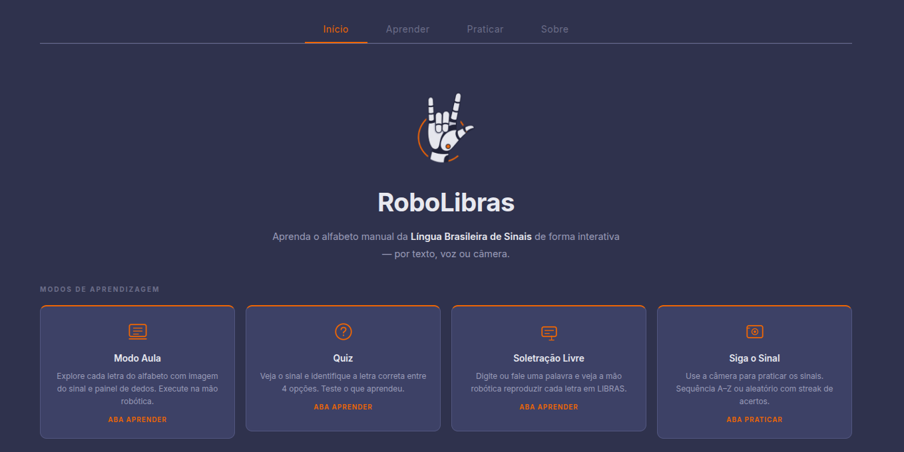
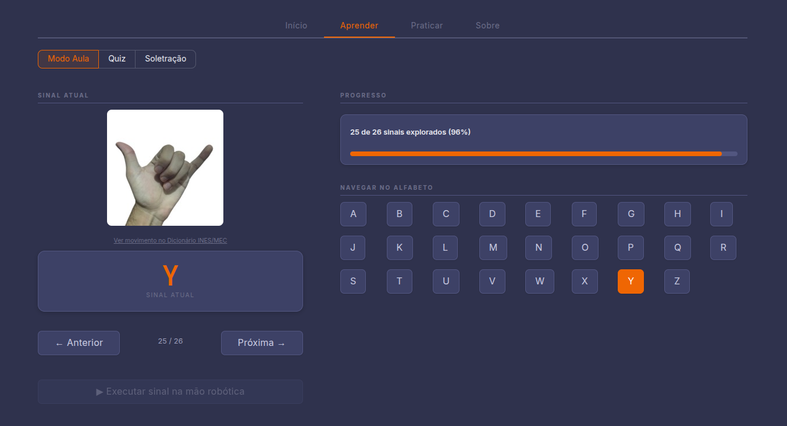
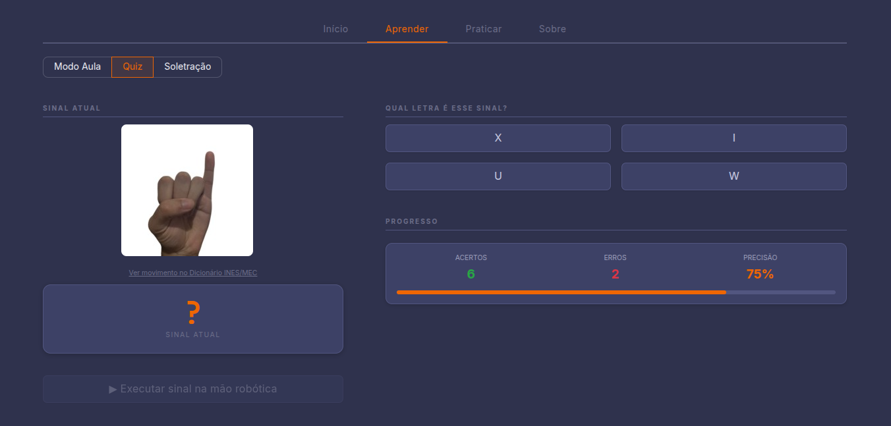
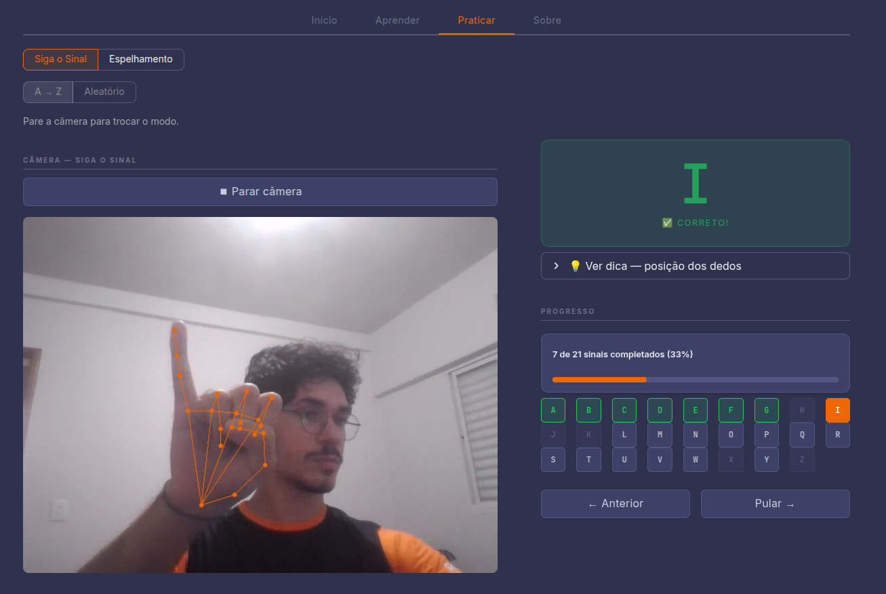

<div align="center">

[](https://www.python.org/)
[](https://www.arduino.cc/)
[](https://mediapipe.dev/)
[](https://streamlit.io/)
[](https://www.gnu.org/licenses/gpl-3.0)


---

<h4>RoboLibras: Objeto de Aprendizagem Multimodal para o Ensino do Alfabeto Manual da LIBRAS</h4>

<a href="#resumo">Resumo</a> •
<a href="#arquitetura-do-sistema">Arquitetura</a> •
<a href="#hardware">Hardware</a> •
<a href="#instalação">Instalação</a> •
<a href="#uso">Uso</a> •
<a href="#estrutura-do-repositório">Estrutura</a> •
<a href="#limitações-conhecidas">Limitações</a> •
<a href="#referências">Referências</a>

</div>

---

## Resumo

O RoboLibras é uma ferramenta educacional para o ensino do alfabeto manual da LIBRAS que combina visão computacional, aprendizado de máquina e uma mão robótica de baixo custo. O sistema oferece cinco modos de aprendizagem: Modo Aula, Quiz, Soletração Livre, Espelhamento e Siga o Sinal, acessíveis via interface web, com ou sem Arduino conectado. Desenvolvido para uso em contextos escolares inclusivos, pode ser utilizado por professores e estudantes ouvintes e não ouvintes sem conhecimento prévio de LIBRAS.

---

## Arquitetura do Sistema


### Modalidades de entrada

| Modalidade | Descrição | Implementação |
|---|---|---|
| **Texto** | Soletração sequencial a partir de string digitada pelo usuário | `src/speller.py` |
| **Voz** | Reconhecimento de fala contínuo em pt-BR em thread assíncrona | `src/voice.py` + Google Speech API |
| **Câmera** | Reconhecimento e espelhamento em tempo real via estimativa de pose da mão | `src/camera.py` + MediaPipe |

---

## Hardware

### Lista de materiais

| Componente | Qtd | Especificação |
|---|---|---|
| Arduino Uno / Nano | 1 | Qualquer placa compatível com StandardFirmata |
| Micro servo SG90 | 5 | Torque: 1,8 kgf·cm · range: 0–180° · alimentação: 4,8–6 V |
| Mão robótica | 1 | Impressão 3D com acionamento por tendões |
| Fios jumper M-M | ~16 | Conexão servos > pinos digitais do Arduino |

> ⚠️ **Atenção:**
> Recomenda-se fonte externa regulada de 5 V para os servos. Alimentar 5 servos SG90 simultaneamente pelo pino 5 V do Arduino pode exceder a corrente máxima suportada (~500 mA via USB), causando instabilidade ou danos à placa.

### Pinagem padrão

| Dedo | Pino digital |
|---|---|
| Polegar | 10 |
| Indicador | 9 |
| Médio | 8 |
| Anelar | 7 |
| Mínimo | 6 |

> Para alterar a pinagem, edite `src/config.py` > `FINGER_PINS`.

---

## Instalação

### 1. Firmware do Arduino

Na Arduino IDE, carregue o **StandardFirmata** em: `Arquivo > Exemplos > Firmata > StandardFirmata > Upload`

### 2. Ambiente Python

> 💡 **Dica:**
> Use **Python 3.10**. A biblioteca `pyFirmata 1.1.0` utiliza `inspect.getargspec`, removido no Python 3.11+. Caso não tenha o Python instalado, baixe [aqui](https://www.python.org/downloads/release/python-31012/).

```bash
git clone https://github.com/ianderichalski/robo-libras.git
cd robo-libras

python --version   # confirme que é 3.10.x

python -m venv venv
source venv/bin/activate    # Linux/macOS
venv\Scripts\activate       # Windows

pip install -r requirements.txt
```

### 3. PyAudio (modo voz)

| Sistema | Comando |
|---|---|
| **Windows** | `pip install pipwin && pipwin install pyaudio` |
| **Linux** | `sudo apt install portaudio19-dev python3-dev && pip install pyaudio` |
| **macOS** | `brew install portaudio && pip install pyaudio` |

> O modo de voz requer conexão com a internet (Google Speech API).

### 4. Porta serial

A porta serial é detectada automaticamente pela interface. Caso necessário, o valor padrão pode ser ajustado em `src/config.py` > `SERIAL_PORT`.

---

## Uso

```bash
streamlit run app.py
```

A interface abre automaticamente no navegador. Os cinco modos de aprendizagem disponíveis:

| Modo | Descrição | Requer Arduino |
|---|---|---|
| **Modo Aula** | Explore o alfabeto A–Z com imagem e painel de dedos | Não |
| **Quiz** | Identifique a letra correspondente ao sinal exibido | Não |
| **Siga o Sinal** | Pratique os sinais A–Z ou em modo aleatório com reconhecimento via câmera | Não |
| **Soletração Livre** | Digite ou fale uma palavra e a mão robótica soletra letra por letra | Sim |
| **Espelhamento** | Espelhe seus gestos na mão robótica em tempo real via câmera | Sim |

> Para calibração dos servos, consulte [CALIBRATION.md](CALIBRATION.md).

---

## Estrutura do Repositório

```
├── app.py              # ponto de entrada
├── src/                # lógica de negócio (câmera, servo, voz, ML)
├── ui/                 # interface Streamlit
├── models/             # modelos de ML
├── tools/              # calibração e treino
└── docs/               # assets de documentação
```

---

## Interface


<br><br>

<br><br>

<br><br>


---

## Limitações Conhecidas

| Limitação | Descrição |
|---|---|
| **Letras H, J, K, X, Z** | Envolvem movimento — não detectáveis por classificação de pose estática |
| **Modo câmera** | Requer iluminação adequada e contraste com o fundo |
| **Modo voz** | Depende de internet e da Google Speech API; sensível a ruído ambiente |
| **Calibração** | Os ângulos de servo são específicos ao modelo físico utilizado |

---

## Trabalhos Futuros

- Suporte a palavras e frases completas em LIBRAS
- Suporte a gestos dinâmicos (letras H, J, K, X, Z) via modelos de sequência temporal
- Segunda mão robótica para sinais compostos
- Testes formais de usabilidade em sala de aula

---

## Referências

[1] Zhang, F., Bazarevsky, V., Vakunov, A., Tkachenka, A., Sung, G., Chang, C., and Grundmann, M. (2020). MediaPipe Hands: On-device Real-time Hand Tracking. *arXiv:2006.10214*. https://arxiv.org/abs/2006.10214

[2] Oliveira, W. (2024). *LIBRAS — Hand Landmarks Dataset*. Kaggle. https://www.kaggle.com/datasets/williansoliveira/libras

[3] INES — Instituto Nacional de Educação de Surdos. (2024). *Dicionário da Língua Brasileira de Sinais V3.* https://dicionario.ines.gov.br